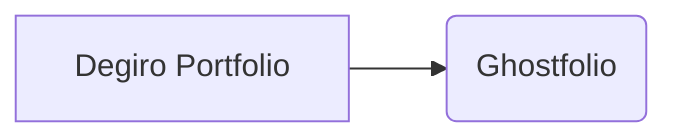

# degiro-ghostfolio
Transfer degiro transactions to a local Ghostfolio instance





## Download & Setup

```bash
git clone https://github.com/topscoder/degiro-ghostfolio
cd degiro-ghostfolio
```

Create a `config.json` file

```bash
cp config/config.json.example config/config.json
```

| Add your specific settings in `config.json`

```json
{
    "degiro_int_account": 0,
    "degiro_username": "",  # Your degiro username which you use to login
    "degiro_password": "",  # Your degiro password, in plain text

    "ghostfolio_auth_token": "",                    # Ghostfolio auth token which you use to login (the long one)
    "ghostfolio_api_host": "http://127.0.0.1:3333"  # URL to your Ghostfolio instance, without trailing slash
}
```

Install project requirements

```bash
pip3 install -r requirements.txt
```

Run transfer of transactions from DEGIRO to GHOSTFOLIO 🥳

```bash
python3 main.py
```